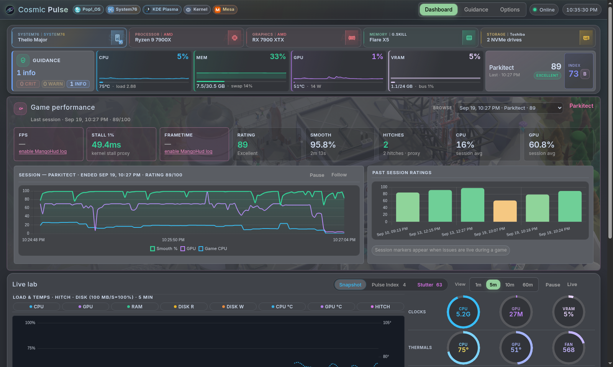

# Cosmic Pulse

**A second-monitor performance coach for Linux gaming.**

Cosmic Pulse is a local web dashboard that helps you understand *why* a game stutters — not just CPU/GPU graphs. It ties together hardware context, kernel stall signals (PSI, page faults, swap), and actionable Guidance steps. Built for [Pop!_OS](https://pop.system76.com/) / COSMIC; works on other Linux distros with Python 3.11+.



> **Status:** v0.1 — community project, **not** an official System76 app. Issues and PRs welcome. Coding agents: start at [AGENTS.md](AGENTS.md).

## Why Cosmic Pulse?

| Typical monitor | Cosmic Pulse |
|-----------------|--------------|
| Raw CPU/GPU % | **Stutter proxy** — hitch score from kernel stall signals |
| Static graphs | **Hardware league** — how this session compares to reference tiers |
| “Google the error” | **Guidance** — ranked issues, copy-paste steps, optional one-click fixes |
| Generic | **Game-aware** — detects running Steam titles, Proton/Wayland context |

Cosmic Pulse is a **companion** for a second monitor while gaming — not a replacement for MangoHud, COSMIC System Monitor, or in-game frametime tools.

## Quick start (Pop!_OS / Ubuntu)

```bash
# Dependencies (once)
sudo apt install python3-psutil python3-yaml

# Install
git clone https://github.com/tramonkamble/cosmic-pulse.git
cd cosmic-pulse
chmod +x install.sh
./install.sh --service
```

Open **http://127.0.0.1:8765**, or run `cosmic-pulse --open`. For a second machine on the LAN: `cosmic-pulse --lan` (or `PULSE_LAN=1`).

Ensure `~/.local/bin` is on your `PATH` so the `cosmic-pulse` command works.

## Features

- **Live lab** — Snapshot (load + clocks/thermals/power), Pulse Index, Stutter; same stage height on every tab
- **Stutter estimate** — hitch score from page faults, PSI, swap, and disk I/O (not in-game frametime)
- **Pulse Index** — session load vs hardware tier tables
- **Guidance** — ranked issues, copy-paste steps, optional one-click user-owned fixes
- **Host identity** — desktop (COSMIC, KDE, GNOME, XFCE, …) and GPU stack (Mesa / NVIDIA)
- **Steam / Proton** — running-title detection, launch-option hints (e.g. Wayland → X11)
- **COSMIC theme sync** — accent and surfaces from `~/.config/cosmic` when present
- **History** — optional SQLite retention for trends

## Requirements

| Required | Notes |
|----------|--------|
| Linux + `/proc`, `/sys` | Any modern distro |
| Python **3.11+** | `python3 --version` |
| `psutil`, `PyYAML` | `sudo apt install python3-psutil python3-yaml` or `pip install -r requirements.txt` |

| Recommended | Notes |
|-------------|--------|
| AMD discrete GPU | Dense sysfs metrics (busy, VRAM, PPT, fan) |
| NVIDIA | `nvidia-smi` meters when the proprietary driver is present |
| `/sys/class/hwmon` | CPU/GPU/NVMe temps and fans (no `sensors` binary) |
| Steam | Game-aware Guidance and log scans |
| Second monitor | Dashboard is meant to sit beside the game |

Optional: `dmidecode`, `smartmontools` (provides `smartctl`), `corectrl`, `nvtop` — surfaced in the tools panel when present.

## Install options

| Method | Best for | Guide |
|--------|----------|--------|
| **`./install.sh --service`** | Most users | Below + [docs/INSTALL.md](docs/INSTALL.md) |
| **`.deb` package** | Optional on Debian/Pop/Ubuntu | [docs/INSTALL.md](docs/INSTALL.md) |
| **`python3 server.py`** | Development | Clone repo, run in tree |

Fedora / Arch: use `install.sh`. No RPM in 0.1.

### Install script flags

```bash
./install.sh --service          # background systemd user service
./install.sh --dir ~/.local/share/cosmic-pulse
./install.sh --port 8765        # set PULSE_PORT
./install.sh --system-python    # skip venv (use apt/pip packages)
./install.sh --uninstall        # remove install + service
```

Install location defaults to `~/.local/share/cosmic-pulse`. The `cosmic-pulse` wrapper is placed in `~/.local/bin`.

### Service commands

```bash
systemctl --user status cosmic-pulse
systemctl --user restart cosmic-pulse
journalctl --user -u cosmic-pulse -f
```

User services start at login. For start-at-boot without login: `loginctl enable-linger "$USER"`.

## Configuration

Local state is **per machine** — never committed to git:

| File | Purpose |
|------|---------|
| `pulse.db` | Sample history (SQLite) |
| `.pulse_config.json` | Retention, suppressed/resolved insights |
| `.tuning_log.json` | Guidance history cache |

Copy the template if you want an explicit config:

```bash
cp .pulse_config.example.json .pulse_config.json
```

**Environment variables:**

| Variable | Default | Purpose |
|----------|---------|---------|
| `PULSE_PORT` | `8765` | HTTP port |
| `PULSE_LAN` | unset | Set to `1` to bind `0.0.0.0` (LAN view, no auth) |
| `PULSE_DATA_DIR` | install dir or `~/.local/share/cosmic-pulse` | Writable state (`.deb` installs) |
| `STEAM_BASE` | auto-detect | Steam root if non-standard |

Details: [docs/ARCHITECTURE.md](docs/ARCHITECTURE.md).

## Security notice

Cosmic Pulse binds to **`127.0.0.1`** by default. Pass **`--lan`** (or `PULSE_LAN=1`) to listen on all interfaces for a second monitor or phone. There is **no authentication**. Use LAN bind only on networks you trust. Do not expose port 8765 to the internet without a reverse proxy and auth.

One-click **Fix** actions are limited to safe, user-owned changes (e.g. open folders, Steam launch options). Root/sudo steps are scripts you run yourself.

## Known limitations (v0.1)

- Stutter score is a **kernel-signal proxy**, not real frametime.
- AMD sysfs is the dense GPU path; NVIDIA depends on `nvidia-smi`.
- Chart.js is vendored (no CDN).
- Some Guidance commands are machine-specific — read them before running.

See [docs/KNOWN_ISSUES.md](docs/KNOWN_ISSUES.md) and [docs/REVIEW.md](docs/REVIEW.md).

## Troubleshooting

| Problem | Try |
|---------|-----|
| `cosmic-pulse: command not found` | `export PATH="$HOME/.local/bin:$PATH"` |
| Blank / “Connecting…” | `journalctl --user -u cosmic-pulse -n 30` |
| Install fails on venv | `sudo apt install python3-psutil python3-yaml` — script falls back to system Python |
| No GPU stats | Check `/sys/class/drm/` — see [docs/REVIEW.md](docs/REVIEW.md) |
| Guidance empty at first | Wait a few seconds; run **Scan** on the Guidance tab |

More: [docs/INSTALL.md](docs/INSTALL.md) § Troubleshooting.

## Project layout

| Path | Role |
|------|------|
| `server.py` | Thin launcher (`python3 server.py`) |
| `cosmic_pulse/` | Application package (HTTP, sampler, Guidance) |
| `index.html` | Dashboard markup |
| `assets/dashboard.css` | Dashboard styles |
| `assets/dashboard-theme.js` / `dashboard-charts.js` / `dashboard.js` | Client logic (classic scripts, load order matters) |
| `cosmic_pulse/rule_packs.py` + `rules/builtin/` | YAML-driven Guidance rules ([docs/RULES.md](docs/RULES.md)) |
| `cosmic_pulse/stutter.py` | Hitch / stutter proxy |
| `cosmic_pulse/games.py` | Steam detection, Proton/Wayland helpers |
| `cosmic_pulse/store.py` | SQLite history and correlations |
| `install.sh` | User-local installer |
| `deploy/build-deb.sh` | Build `.deb` for apt |

## API (selected)

| Endpoint | Description |
|----------|-------------|
| `GET /` | Dashboard |
| `GET /api/metrics` | Latest sample; `?bootstrap=1` for full history + static rig |
| `GET /api/diagnostics` | Troubleshooting scan (`?force=1` to bypass cache) |
| `POST /api/store` | Retention, suppress/resolve insights |
| `GET /api/trends`, `/api/correlation` | Historical series |

Full data flow: [docs/ARCHITECTURE.md](docs/ARCHITECTURE.md).

## Documentation

| Doc | Contents |
|-----|----------|
| [AGENTS.md](AGENTS.md) | Map for Claude / Gemini / Codex / other coding agents |
| [docs/INSTALL.md](docs/INSTALL.md) | Install script, `.deb`, systemd, uninstall |
| [docs/RULES.md](docs/RULES.md) | How to write Guidance YAML packs (schema, metrics, style) |
| [RULE_PACKS.md](RULE_PACKS.md) | Builtin vs community packs; annotated example |
| [docs/ARCHITECTURE.md](docs/ARCHITECTURE.md) | Sampler loop, Guidance contracts, config paths |
| [docs/REVIEW.md](docs/REVIEW.md) | Security focus, review checklist |
| [docs/KNOWN_ISSUES.md](docs/KNOWN_ISSUES.md) | Open technical findings |
| [CONTRIBUTING.md](CONTRIBUTING.md) | Git workflow, lint, tests |
| [CHANGELOG.md](CHANGELOG.md) | Release notes |
| [SECURITY.md](SECURITY.md) | Bind address, LAN, how to report |

## Contributing

Pull requests and structured AI reviews welcome.

```bash
python3 tests/harness.py
# optional: ruff check . && ruff format .
```

See [CONTRIBUTING.md](CONTRIBUTING.md). Use the **AI review finding** issue template if an agent spotted something.

## License

**GPL-3.0-only** — aligned with [Pop!_OS application licensing](https://github.com/pop-os/pop/blob/master/LICENSING.md). See [LICENSE](LICENSE) and [LICENSING.md](LICENSING.md).